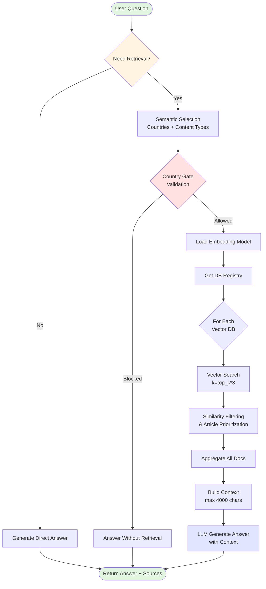
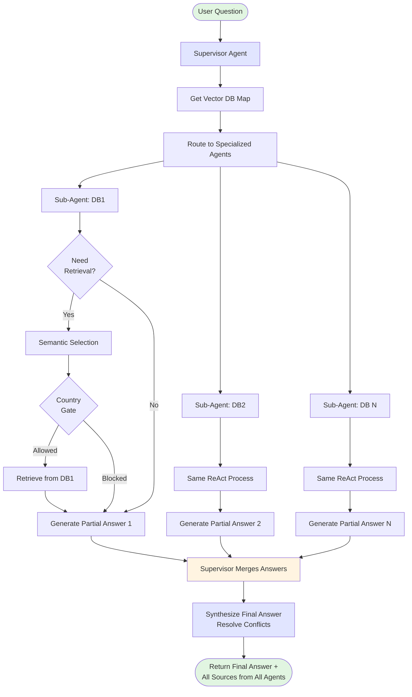
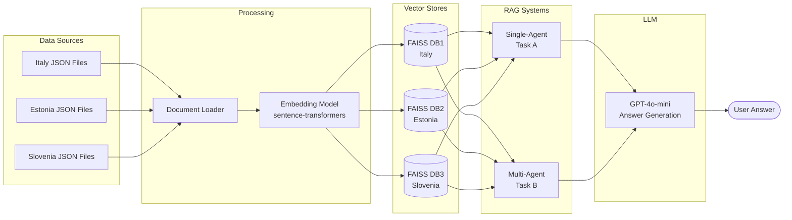

# Architecture Documentation - Legal RAG System

## Table of Contents
1. [Overview](#overview)
2. [System Architectures](#system-architectures)
3. [Architecture Diagrams](#architecture-diagrams)
4. [Component Details](#component-details)
5. [Model Configuration](#model-configuration)
6. [Performance Comparison](#performance-comparison)

---

## Overview

This project implements two RAG (Retrieval-Augmented Generation) architectures for querying multinational legal documents:

- **Task A: Single-Agent System** - A unified ReAct-style agent that handles routing internally
- **Task B: Multi-Agent System** - A supervisor agent that delegates to specialized sub-agents

Both systems operate on a dataset covering **Inheritance** and **Divorce** laws across **Italy**, **Estonia**, and **Slovenia**.

---

## System Architectures

### Task A: Single-Agent RAG System (ReAct)

The single-agent system uses a **ReAct (Reasoning + Acting)** pattern where a single LLM agent:

1. **Thinks**: Decides whether retrieval is needed
2. **Acts**: Performs semantic selection of countries and content types
3. **Gates**: Validates country support before retrieval
4. **Retrieves**: Searches all vector databases with similarity filtering
5. **Answers**: Generates response using retrieved context

**Key Features:**
- Unified decision-making process
- Country gate validation prevents unsupported queries
- Article-aware retrieval (prioritizes explicitly mentioned articles)
- Semantic similarity re-ranking
- Single LLM call for classification and single call for answer generation

**Flow:**
```
User Question
    ↓
Decision: Need Retrieval?
    ↓ (if yes)
Semantic Selection (Countries + Content Types)
    ↓
Country Gate Validation
    ↓ (if allowed)
Retrieve from All Vector DBs
    ↓
Similarity Filtering & Re-ranking
    ↓
Generate Answer with Context
    ↓
Return Answer + Sources
```

### Task B: Multi-Agent RAG System (Supervisor)

The multi-agent system uses a **hierarchical architecture** with:

1. **Supervisor Agent**: Routes queries and synthesizes answers
2. **Specialized Sub-Agents**: Each handles a specific vector database
3. **Aggregation**: Supervisor merges responses from multiple agents

**Key Features:**
- Specialized agents per vector database
- Each sub-agent uses same ReAct logic as Task A internally
- Supervisor synthesizes coherent final answer
- Parallel retrieval from multiple specialized sources
- Better scalability for large, diverse datasets

**Flow:**
```
User Question
    ↓
Supervisor Agent
    ↓
Route to Specialized Agents (one per vector DB)
    ↓
Each Sub-Agent:
  - Decides need for retrieval
  - Semantic selection
  - Country gate
  - Retrieve from its DB
  - Generate partial answer
    ↓
Supervisor Synthesizes Final Answer
    ↓
Return Merged Answer + All Sources
```

---

## Architecture Diagrams

### Single-Agent System Flowchart



### Multi-Agent System Flowchart



### Data Flow Diagram



---

## Component Details

### 1. Configuration Management

**File:** `backend/config.py`

Centralized configuration using a dataclass:
- LLM provider and model selection
- Embedding provider and model
- Data folder paths
- Vector store directories
- Retrieval parameters (top_k, reranking)
- Agentic mode selection
- Multi-agent toggle

### 2. Document Loading

**File:** `backend/document_loader.py`

- Recursively loads JSON files from specified folders
- Extracts metadata (country, law type, case ID, etc.)
- Preserves document structure and content
- Supports multiple JSON schemas (codes, cases)

### 3. Embeddings

**File:** `backend/embeddings.py`

**Selected Model:** `sentence-transformers/all-MiniLM-L6-v2`

**Justification:**
- **Open-source**: No API costs, runs locally
- **Performance**: 384-dimensional embeddings, good balance of quality and speed
- **Size**: Lightweight (~90MB), fast inference
- **Multilingual**: Works well for English legal documents
- **Widely adopted**: Well-tested in production environments

**Alternative Considered:** OpenAI `text-embedding-3-small`
- Better quality but requires API calls and has costs
- Used as fallback option in configuration

### 4. Vector Store

**File:** `backend/vector_store.py`

**Technology:** FAISS (Facebook AI Similarity Search)

**Features:**
- Fast similarity search using L2 distance
- In-memory caching for performance
- Persistent storage on disk
- Supports multiple independent databases

### 5. LLM Provider

**File:** `backend/llm_provider.py`

**Selected Model:** `gpt-4o-mini` (OpenAI)

**Justification:**
- **Cost-effective**: Cheaper than GPT-4 while maintaining quality
- **Fast**: Low latency for interactive responses
- **Instruction-following**: Excellent at following structured prompts
- **JSON output**: Reliable structured output for semantic selection
- **Context window**: 128K tokens, sufficient for legal documents

**Parameters:**
- Temperature: 0.0 (deterministic answers)
- Max tokens: Configured per use case
- API: OpenAI API via LangChain

### 6. RAG Pipelines

#### Single-Agent Pipeline
**File:** `backend/rag_single_agent.py`

Key functions:
- `decide_need_retrieval()`: Determines if retrieval is needed
- `decide_relevant_slices()`: Semantic selection of countries/content
- `country_gate()`: Validates supported countries
- `retrieve_from_db()`: Vector search with similarity filtering
- `single_agent_answer_question()`: Main entry point

#### Multi-Agent Pipeline
**File:** `backend/rag_multiagent.py`

Key functions:
- `decide_which_dbs()`: Routes query to relevant databases
- `subagent_answer_question_with_slices()`: Individual agent logic
- `multiagent_answer_question()`: Supervisor orchestration

### 7. Unified Pipeline

**File:** `backend/rag_pipeline.py`

Central dispatcher that routes to appropriate system based on configuration:
- Single-agent (Task A)
- Multi-agent (Task B)
- Hybrid legal RAG (optional extension)

### 8. Evaluation

**File:** `pages/4_RAG_Evaluation.py`

**Framework:** RAGAS (Retrieval Augmented Generation Assessment)

**Metrics Computed:**
1. **Context Precision**: Relevance of retrieved chunks
2. **Context Recall**: Coverage of needed information
3. **Faithfulness**: Grounding in source documents
4. **Answer Relevancy**: Topical alignment with question
5. **Answer Correctness**: Similarity to ground truth

**Evaluation LLM:** GPT-4o-mini (via OpenAI API)
**Evaluation Embeddings:** text-embedding-3-small (OpenAI)

### 9. API Endpoint

**File:** `backend/api_endpoint.py`

**Framework:** FastAPI

**Endpoints:**
- `GET /health`: Health check
- `GET /system_info`: System configuration
- `POST /query`: Single question endpoint
- `POST /batch_query`: Batch processing

**Features:**
- OpenAPI documentation at `/docs`
- Pydantic validation
- CORS enabled
- Error handling with HTTP exceptions

---

## Model Configuration

### Embedding Model

| Attribute | Value |
|-----------|-------|
| **Provider** | Hugging Face (sentence-transformers) |
| **Model Name** | `sentence-transformers/all-MiniLM-L6-v2` |
| **Type** | Open-source |
| **Dimensions** | 384 |
| **Max Sequence Length** | 256 tokens |
| **Model Size** | ~90 MB |
| **License** | Apache 2.0 |

**Justification:**
- No API costs or rate limits
- Fast local inference
- Good semantic understanding for legal text
- Proven performance on retrieval tasks
- Easy deployment

### Generative Model

| Attribute | Value |
|-----------|-------|
| **Provider** | OpenAI |
| **Model Name** | `gpt-4o-mini` |
| **API Key Required** | Yes |
| **Context Window** | 128,000 tokens |
| **Temperature** | 0.0 |
| **Max Output Tokens** | ~2048 (default) |

**Justification:**
- Excellent instruction following
- Cost-effective for production use
- Reliable JSON-mode output for structured tasks
- Low latency
- Strong reasoning capabilities for legal questions

---

## Performance Comparison

### Conceptual Performance Table

This table will be populated with actual RAGAS metrics after evaluation:

| Metric | Single-Agent (Task A) | Multi-Agent (Task B) | Notes |
|--------|----------------------|---------------------|-------|
| **Context Precision** | TBD | TBD | How relevant are retrieved docs? |
| **Context Recall** | TBD | TBD | Is all needed info retrieved? |
| **Faithfulness** | TBD | TBD | Answer grounded in sources? |
| **Answer Relevancy** | TBD | TBD | Answer addresses the question? |
| **Answer Correctness** | TBD | TBD | Match with ground truth? |
| **Avg Response Time** | TBD | TBD | Speed (seconds) |
| **Scalability** | Medium | High | Ability to handle more data sources |
| **Complexity** | Low | Medium | Implementation complexity |

### Strengths & Weaknesses

#### Single-Agent System (Task A)

**Strengths:**
- ✅ Simpler architecture, easier to debug
- ✅ Lower LLM API costs (fewer calls)
- ✅ Faster for small datasets
- ✅ Consistent reasoning path
- ✅ Direct control over retrieval logic

**Weaknesses:**
- ❌ Doesn't scale well with many data sources
- ❌ All documents compete in same pool
- ❌ May miss nuanced differences between jurisdictions
- ❌ Single point of failure

#### Multi-Agent System (Task B)

**Strengths:**
- ✅ Better scalability for diverse datasets
- ✅ Specialized agents can develop expertise
- ✅ Parallel retrieval possible
- ✅ Easier to extend with new jurisdictions
- ✅ Can compare answers across agents

**Weaknesses:**
- ❌ Higher complexity and maintenance
- ❌ More LLM API calls (higher cost)
- ❌ Synthesis step can introduce inconsistencies
- ❌ Slower for simple queries
- ❌ Requires careful supervisor tuning

### Recommendation

**For this specific task (3 countries, 2 legal areas):**

Both systems are viable, but **Multi-Agent (Task B) is recommended** because:

1. **Jurisdiction Separation**: Legal systems differ significantly between countries; specialized agents respect these boundaries
2. **Scalability**: Easier to add more countries or legal areas without retraining
3. **Explainability**: Can trace which agent contributed which information
4. **Future-proofing**: Architecture supports growth

However, **Single-Agent (Task A)** may perform better if:
- Response time is critical
- Budget constraints exist (fewer API calls)
- Dataset remains small and focused

**Actual performance metrics from the RAGAS evaluation will provide definitive guidance.**

---

## Logging and Transparency

Both systems provide:

1. **Source Attribution**: Every answer includes source documents with metadata
2. **Reasoning Traces**: Optional detailed logs of decision-making process
3. **JSON Conversation Logs**: Structured storage in `chat_sessions.json`
4. **Metadata Tracking**: Country, law type, case IDs, articles cited

Format of logged conversations:
```json
{
  "id": 1,
  "title": "User question preview",
  "history": [
    {
      "role": "user",
      "content": "Question text"
    },
    {
      "role": "assistant",
      "content": "Answer text",
      "contexts": ["Retrieved chunk 1", "Retrieved chunk 2"],
      "source_ids": ["source1.json", "source2.json"]
    }
  ]
}
```

---

## Conclusion

This dual-architecture implementation provides:
- **Flexibility**: Choose the right architecture for your use case
- **Transparency**: Full visibility into retrieval and reasoning
- **Scalability**: Multi-agent system ready for expansion
- **Evaluation**: RAGAS metrics for objective comparison
- **Production-Ready**: FastAPI endpoint for integration

Both systems achieve the core goal: **accurate, grounded answers to legal questions across multiple jurisdictions**, with full source attribution and evaluation capabilities.
